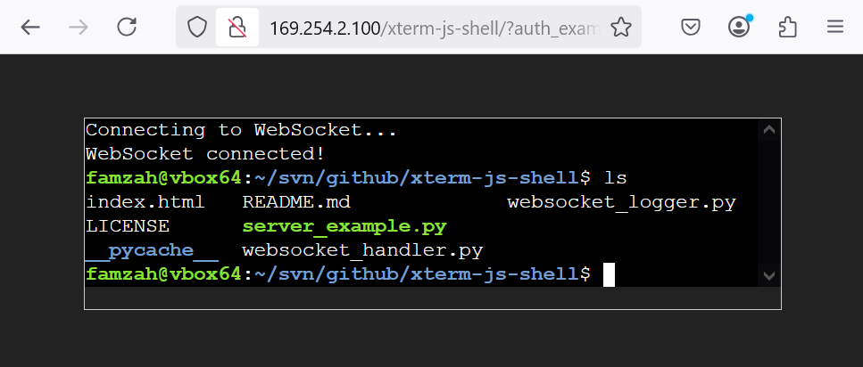

# About
Start a direct web Bash shell using Xterm.js - no SSH connection required. This is a single-user shell that runs with the privileges of the process that started it, and it can handle multiple simultaneous connections.

This project has not been tested at scale but has passed a ChatGPT code audit and is expected to be fully functional.

# Usage
You need to create your own "asyncio" server and then pass the "websocket" connections to the WebSocketHandler which is provided by "websocket_handler.py". The "server_example.py" shows how to implement a server. To run the current example:
- Run "server_example.py" which starts a WebSocket server on TCP port 8765.
- Serve "index.html" from a web server like Apache or Nginx on the same host that you started the WebSocket server.
- Open "index.html" in a web browser.

Authentication notes:
- If you started "server_example.py" with the option "noauth", open "index.html" without any GET parameters.
- If you started "server_example.py" with the option "auth", open "index.html?auth_example=letmein" in your browser to activate the sample authentication process.

Production use:
- Do not expose the WebSocket server directly to the internet. Instead, use a web proxy like Apache or Nginx to provide SSL termination and forward connections locally.
- The WebSocket server can also listen on a UNIX socket for enhanced security. Restrict access to the UNIX socket file so only the web proxy can connect.

# Architecture
The project is based on "asyncio" and supports authentication, detailed logging, and graceful shell termination.

The graceful termination feature allows you to run the web shell server in a "socket activation" mode. You can start the server on demand and terminate it when there are no active connections for a while. A typical use case is to launch the web shell server as part of the initial authentication process.

The [asyncio web server](https://websockets.readthedocs.io/en/stable/reference/asyncio/server.html#creating-a-server) can bind to either a TCP port or a UNIX socket. The latter is particularly useful when starting a web shell server on demand for each user. You can create a unique UNIX socket filename for each user's server in a secure path. WebSocket HTTP requests can then be proxied to the appropriate UNIX socket using a user-friendly URL format such as "wss://example.com/xterm-js-shell/user1".

Example authentication process:
- The user opens the web "index.html" page for the first time.
- The "index.html" page is either dynamically generated or makes a fetch() request to an authentication system.
- The authentication system generates a JWT token. Up to this point, the web shell server is not involved, yet.
- The web "index.html" page then connects to the web shell server and provides the JWT token.
- The JWT token is validated by the implementation of auth_callback().

# WebSocketHandler parameters
The "WebSocketHandler" is the code which handles an [asyncio web server](https://websockets.readthedocs.io/en/stable/reference/asyncio/server.html#creating-a-server) connection. It is provided by "websocket_handler.py" and has the following options:
- **websocket**: The WebSocket connection instance.
- **auth_callback**: A function to authenticate the connection. Should accept (message, websocket, logger) and return a boolean indicating success.
- **logger** (Optional): A custom logger instance. If omitted, a logger is created using WebSocketLoggerFactory which is implemented in "websocket_logger.py".
- **log_id** (Optional): Identifier for logging. Defaults to `websocket.id` if no custom logger is provided.
- **log_level** (Optional): Logging level (default: logging.INFO). If you use the default WebSocketLoggerFactory, you can also use `WebSocketLoggerFactory.DEBUG_MIN` for less verbose logging than `logging.DEBUG`.
- **user_shell_command** (Optional): The command to launch the shell as a list (default: ['/bin/bash', '-l']).
- **shutdown_event** (Optional): An event to signal a shutdown request.
- **shell_logout_wait** (Optional): Seconds to wait for a graceful shell logout (default: 1 second).
- **shell_terminate_wait** (Optional): Seconds to wait before forcefully terminating the shell with SIGKILL (default: 3 seconds).
- **auth_timeout** (Optional): Timeout in seconds for receiving authentication data (default: 5 seconds).
